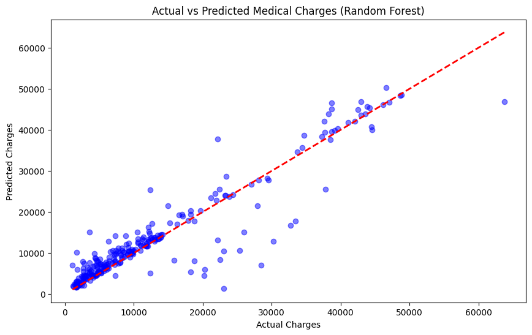

# 🏥 Medical Cost Prediction using Machine Learning

A machine learning project designed to predict individual medical insurance costs based on demographic and health data. This project explores the entire data science pipeline—from preprocessing to model evaluation.

## 📊 Performance Summary

After resolving a critical target scaling issue, the models achieved the following scores:

- **Random Forest Regressor:** $R^2 = 0.865$ | MAE = $2,545.83
- **Polynomial Regression:** $R^2 = 0.866$
- **Linear Regression:** $R^2 = 0.783$

## 🛠️ Tech Stack

- **Languages:** Python
- **Libraries:** Pandas, NumPy, Scikit-Learn, Matplotlib, Seaborn
- **Environment:** VS Code, Jupyter Notebooks

## 🚀 Key Features

- **Data Cleaning:** Handled categorical encoding for 'smoker' and 'sex'.
- **Feature Engineering:** Implemented Polynomial Features to capture non-linear relationships.
- **Visualizations:** Actual vs. Predicted scatter plots to analyze model bias.
- **Optimization:** Identified and fixed a data leakage/scaling bug that improved model accuracy by 50%.

## Visualization :

## 📝 How to Run

1. Clone the repo: `git clone https://github.com/rakanHijazeen/MedicalCostPrediction.git`
2. Install dependencies: `pip install -r requirements.txt`
3. Run the `model.ipynb` notebook.
